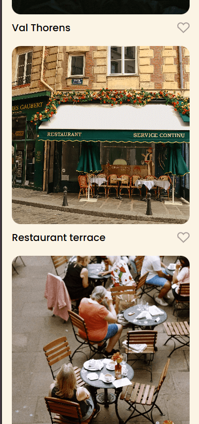
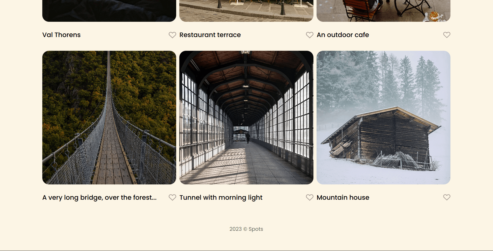

# Project 3: Spots

### Overview

- Intro
- Project Description
- Images
- Tech Stack

**Intro**

This project is made using responsive desgin to ensure that all elements are displayed correctly on a range of devices, from mobile view to desktop.

**Project Description**

This project follows designs specified in the Figma layout below.

- [Link to the project on Figma](https://www.figma.com/file/BBNm2bC3lj8QQMHlnqRsga/Sprint-3-Project-%E2%80%94-Spots?type=design&node-id=2%3A60&mode=design&t=afgNFybdorZO6cQo-1)

**Images**

- Screenshots of finished product.
  
  
  
  
  

- Images pulled from Figma.
  
  
  
  
  
  
  
  
  
  
  

**Tech Stack**

- HTML
- CSS
- Responsive web design
